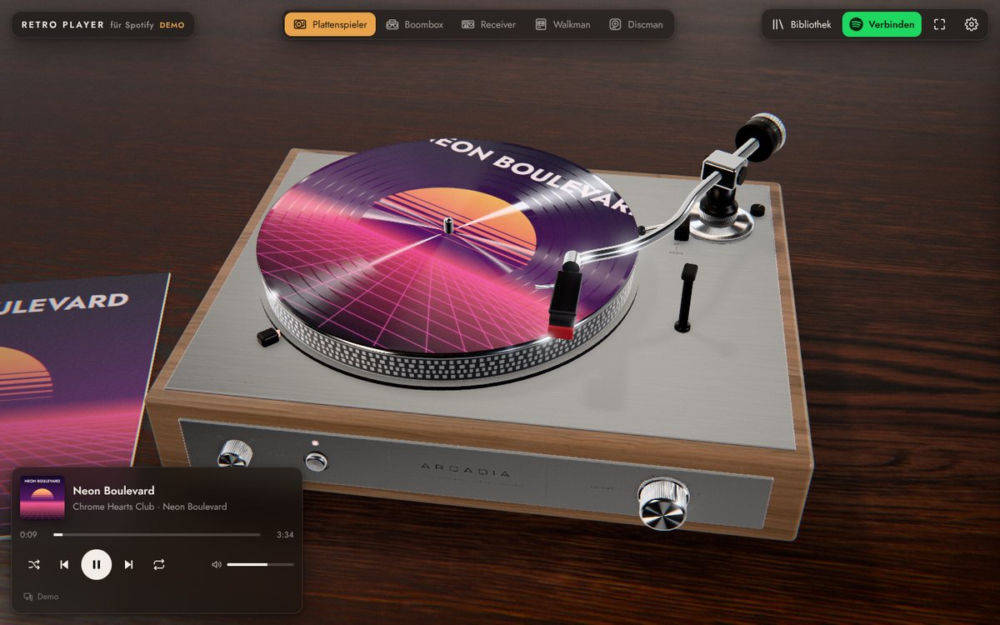
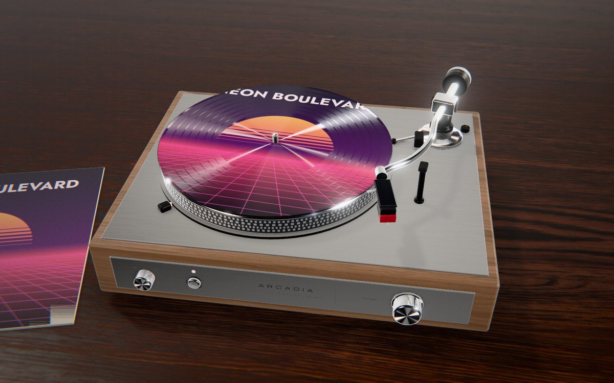
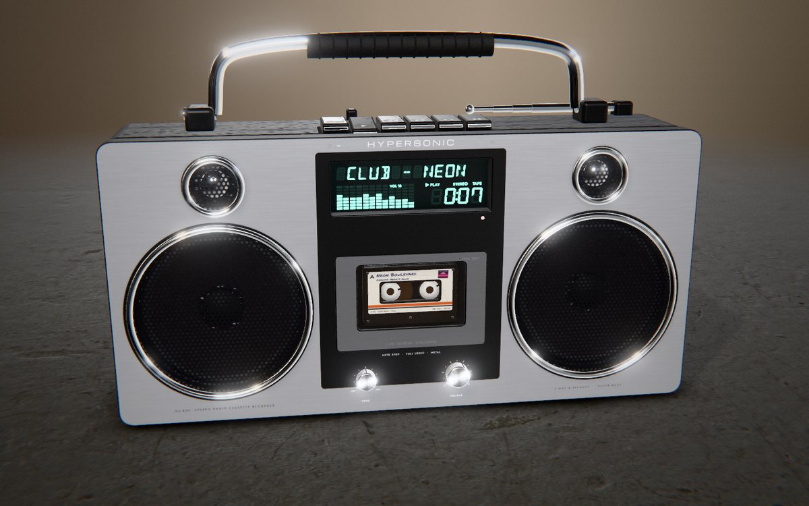
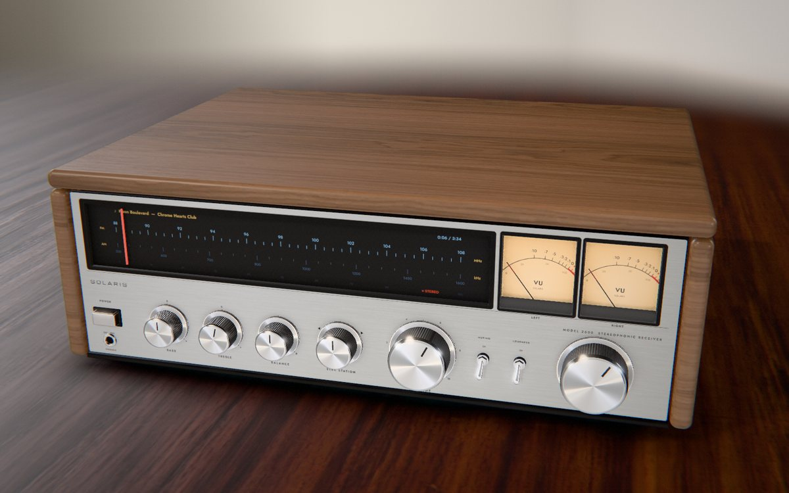
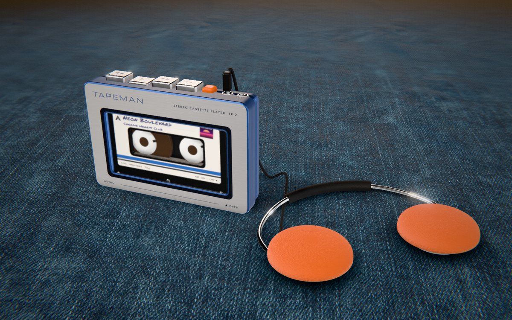
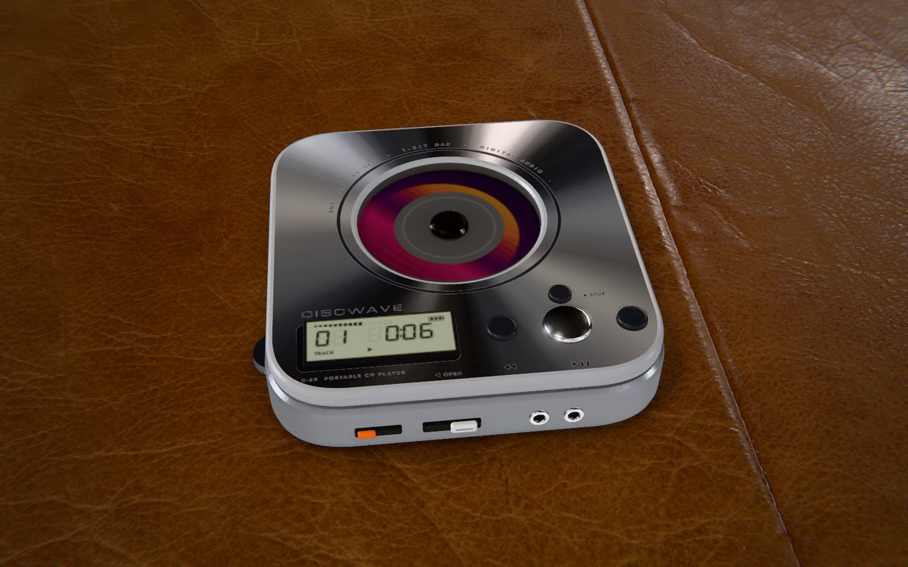

# Retro Player für Spotify

Spotify hören über **fotorealistische Klassiker** – Plattenspieler, Boombox, Stereo-Receiver, Walkman und Discman.
Alles läuft als Web-App im Browser und lässt sich am Rechner **als App installieren** (PWA).



| Plattenspieler | Boombox |
| --- | --- |
|  |  |
| **Receiver** | **Walkman** |
|  |  |
| **Discman** | |
|  | |

> Alle Bilder sind Echtzeit-Renderings direkt aus der App (keine Fotos).

## Die Geräte

| Gerät | So wird es bedient |
| --- | --- |
| **Plattenspieler** | Den **Tonarm auf die Platte ziehen** – die Nadel setzt gedämpft auf und die Musik startet. Die Position auf der Platte entspricht der Position im Song (außen = Anfang, innen = Ende), der Arm wandert beim Hören langsam nach innen. Die Platte ist eine **Picture-Disc mit dem Album-Cover**, die Hülle liegt daneben. Drehknöpfe: **VOLUME** (Lautstärke) und **SPEED** (33/45). START·STOP-Taste und Lift-Hebel funktionieren ebenfalls. |
| **Boombox** | **Piano-Tasten** oben: ▶ rastet ein, ◀◀/▶▶ wechseln den Titel, ■▲ stoppt bzw. öffnet das Kassettenfach, ❚❚ pausiert. Die **VFD-Anzeige** zeigt den Titel als 14-Segment-Laufschrift, die Zeit als 7-Segment-Ziffern und ein Spektrum. Die Lautsprechermembranen schwingen mit. |
| **Receiver** | **POWER** = Play/Pause (die Skalenbeleuchtung glimmt an und aus), großer **TUNING**-Knopf = im Titel spulen (der Senderzeiger ist die Position), **SEEK STATION** = vorheriger/nächster Titel, **VOLUME**, **MUTING**. Zwei **VU-Meter** mit gefederten Zeigern. |
| **Walkman** | Tasten an der Oberkante (◀◀ ▶ ▶▶ ■▲), **Rändelrad** links = Lautstärke, orange **HOTLINE** = stumm. Die Bandwickel der Kassette zeigen den Fortschritt, das Etikett ist „handbeschriftet“ mit dem aktuellen Titel. |
| **Discman** | ▶❚❚, ◀◀, ▶▶, ■ auf dem Deckel, **Rad** links = Lautstärke, **HOLD** sperrt die Tasten, **OPEN** klappt den Deckel auf. Die CD trägt das Cover als Aufdruck und zeigt beim Drehen echte Bewegungsunschärfe; das LCD zeigt Titelnummer und Zeit. |

Überall gilt: Maus ziehen dreht die Kamera, Mausrad zoomt, **Doppelklick** setzt die Ansicht zurück. Über jedem Bedienelement erscheint ein Hinweis.

### Tastatur

| Taste | Funktion |
| --- | --- |
| Leertaste | Play / Pause |
| ← / → | 10 s zurück / vor |
| Shift + ← / → | Vorheriger / nächster Titel |
| ↑ / ↓ | Lautstärke |
| 1 – 5 | Gerät wechseln |
| L | Bibliothek & Suche |
| F | Vollbild |
| R | Ansicht zurücksetzen |

## Schnellstart

Ohne Spotify-Konto lässt sich alles im **Demo-Modus** ausprobieren (Beispieltitel, ohne Ton).

### 1. Spotify-App anlegen (einmalig, ca. 2 Minuten)

Spotify erlaubt Drittanbieter-Playern den Zugriff nur über eine eigene App im Developer-Dashboard:

1. [developer.spotify.com/dashboard](https://developer.spotify.com/dashboard) öffnen → **Create app**.
2. **Redirect URI** exakt so eintragen, wie die App erreichbar ist, z. B.
   - lokal: `http://127.0.0.1:5173/`
   - GitHub Pages: `https://<benutzer>.github.io/retro-player/`
3. Bei den APIs **Web API** und **Web Playback SDK** auswählen und speichern.
4. Die **Client ID** kopieren und in der App unter **Einstellungen** eintragen (oder fest per `VITE_SPOTIFY_CLIENT_ID` einbauen, siehe unten).
5. Solange die App im *Development Mode* ist: unter **User Management** die Spotify-E-Mail-Adressen aller Nutzer eintragen.

Es wird **kein Client Secret** benötigt – der Login läuft über den „Authorization Code Flow with PKCE“ komplett im Browser.

### 2. Lokal starten

```bash
npm install
npm run dev
```

Dann **http://127.0.0.1:5173/** öffnen. Wichtig: nicht `localhost` verwenden – Spotify akzeptiert seit 2025 als Redirect-URI nur noch HTTPS oder Loopback-IPs (`127.0.0.1`).

Optional die Client ID fest einbauen: `.env.example` nach `.env.local` kopieren und `VITE_SPOTIFY_CLIENT_ID` setzen.

### 3. Veröffentlichen (GitHub Pages)

Der Workflow `.github/workflows/deploy.yml` baut und veröffentlicht die App bei jedem Push auf `main`:

1. Im Repository: **Settings → Pages → Source: GitHub Actions**.
2. Optional: **Settings → Secrets and variables → Actions → Variables** → `SPOTIFY_CLIENT_ID` anlegen, dann ist die Client ID bereits eingebaut.
3. Die Pages-URL (`https://<benutzer>.github.io/<repo>/`) als Redirect URI in der Spotify-App eintragen.

Jeder andere statische HTTPS-Host funktioniert ebenfalls (`npm run build`, Inhalt von `dist/` hochladen). Für ein Unterverzeichnis beim Build `BASE_PATH=/pfad/` setzen.

## Als App installieren

- **Chrome / Edge** (Windows, macOS, Linux): Installieren-Symbol in der Adressleiste oder Knopf **„Installieren“** oben rechts in der App.
- **Safari (macOS Sonoma+)**: Ablage → *Zum Dock hinzufügen*.
- **iOS / iPadOS**: Teilen → *Zum Home-Bildschirm*.

Die installierte App startet in einem eigenen Fenster; Texturen und Schriften werden vom Service Worker zwischengespeichert.

## Hinweise & Einschränkungen

- **Spotify Premium** ist für die Wiedergabe im Browser (Web Playback SDK) erforderlich. Ohne Premium kann die App den Titel eines anderen Spotify-Geräts anzeigen, aber nicht steuern.
- **Development Mode** (Stand Februar 2026): max. 5 eingetragene Nutzer pro App, der App-Besitzer braucht Premium. Die App nutzt nur Endpunkte, die nach der Umstellung weiterhin verfügbar sind (Suche mit max. 10 Treffern pro Seite, Playlists werden direkt per `context_uri` abgespielt).
- **Gerätewahl**: In der Bibliothek unter *Geräte* lässt sich die Wiedergabe auch auf andere Spotify-Geräte (Handy, Desktop-App, Lautsprecher) legen – die Retro-Geräte steuern dann dieses Gerät.
- **VU-Meter, LED-Spektrum und Membranbewegung** sind simuliert: Spotify gibt aus DRM-Gründen keine Audiodaten an den Browser weiter, und die Audio-Analyse-API ist für neue Apps abgeschaltet. Tempo und Charakter werden aus dem Titel abgeleitet.
- Die Gerätenamen (ARCADIA, HYPERSONIC, SOLARIS, TAPEMAN, DISCWAVE) sind frei erfunden.

## Technik

- **Rendering:** [three.js](https://threejs.org) mit physikalisch basierten Materialien (`MeshPhysicalMaterial`: Anisotropie für gebürstetes und abgedrehtes Aluminium sowie Vinylrillen, Klarlack, Sheen für Stoff/Schaumstoff, echte Transmission für Acrylglas), HDRI-Umgebungslicht, weiche Schatten, Kontaktschatten, GTAO (Umgebungsverdeckung), HDR-Bloom für LEDs, VFDs und Skalenlampen, Neutral-Tonemapping und eine dezente Objektiv-Simulation (Vignette, Körnung, chromatische Aberration).
- **Fotografische Tiefenunschärfe** des Untergrunds per Shader (Mip-Bias und Ausblendung mit der Entfernung).
- **Flächige Lichtquellen:** Ein Shader-Patch verbreitert direkte Glanzlichter, damit Chrom nicht die typischen „CG-Punktlichter“ zeigt.
- **Prozedurale Mikrostruktur:** Schleifspuren, Rändelungen, Spritzguss-Narbung, Fingerabdrücke, Staub, Lochblech, Papierfasern – alles zur Laufzeit auf Canvas erzeugt.
- **Beschriftungen** (Siebdruck) werden als eigene Farb-/Rauheits-/Metallizitätskanäle gedruckt, sodass matte Druckfarbe korrekt auf glänzendem Metall sitzt.
- **Segmentanzeigen** mit den DSEG-Schriften (7- und 14-Segment) inklusive schwach sichtbarer, unbeleuchteter Segmente.
- **Spotify:** PKCE-Login, Web API und Web Playback SDK; Fallback auf Fernsteuerung anderer Geräte.
- **PWA:** [vite-plugin-pwa](https://vite-pwa-org.netlify.app) (Manifest, Service Worker, Offline-Cache für Texturen).

### Projektstruktur

```
src/
  app.ts                 App-Steuerung (Gerätewechsel, Wiedergabe, Cover)
  engine/                Stage (Renderer, Licht, Postprocessing), Interaktion,
                         Materialien, prozedurale Texturen, Siebdruck, Geräusche
  designs/               Die fünf Geräte + gemeinsame Bauteile (Knöpfe, Kassette, Anzeigen)
  playback/              Spotify- und Demo-Wiedergabe mit gemeinsamer Schnittstelle
  spotify/               Login (PKCE), Web-API-Client, SDK-Loader
  ui/                    Oberfläche: Kopfzeile, Now Playing, Bibliothek, Einstellungen, Installation
public/assets/           HDRIs und Oberflächentexturen (Poly Haven, CC0)
scripts/                 Icons erzeugen, Screenshots & Interaktionstests (Playwright)
```

### Nützliche Skripte

```bash
npm run build        # Typprüfung + Produktionsbuild nach dist/
npm run preview      # Build lokal ansehen (http://127.0.0.1:4173/)
npm run icons        # PWA-Icons neu erzeugen
npm run screenshots  # Screenshots aller Geräte (Dev-Server muss laufen)
node scripts/interaction-test.mjs   # klickt/zieht alle Bedienelemente automatisiert
```

Die Skripte nutzen `playwright-core` mit einem vorhandenen Chromium (Pfad per `CHROME=/pfad/zu/chrome`).

Debug-Parameter in der URL: `?demo=1` (Demo erzwingen), `?design=boombox`, `?quality=low|medium|high`, `?clean=1` (Oberfläche ausblenden), `?autoplay=1`.

## Credits & Lizenzen

- Code: GPL-3.0 (siehe [LICENSE](LICENSE))
- [three.js](https://github.com/mrdoob/three.js) – MIT
- HDRIs & Texturen: [Poly Haven](https://polyhaven.com) – CC0 (studio_small_09, wooden_lounge, walnut_veneer_02, wood_table_001, concrete_floor_worn_001, denmin_fabric_02, fabric_leather_02, dark_wood)
- Schriften: [DSEG](https://github.com/keshikan/DSEG), Jost, Barlow Condensed, Michroma – SIL OFL 1.1; Permanent Marker – Apache 2.0
- [vite-plugin-pwa](https://github.com/vite-pwa/vite-plugin-pwa) – MIT

Spotify ist eine Marke der Spotify AB. Dieses Projekt steht in keiner Verbindung zu Spotify. Album-Cover werden über die Spotify-API geladen; in der Titelanzeige erscheinen sie unverändert mit Link zu Spotify.
